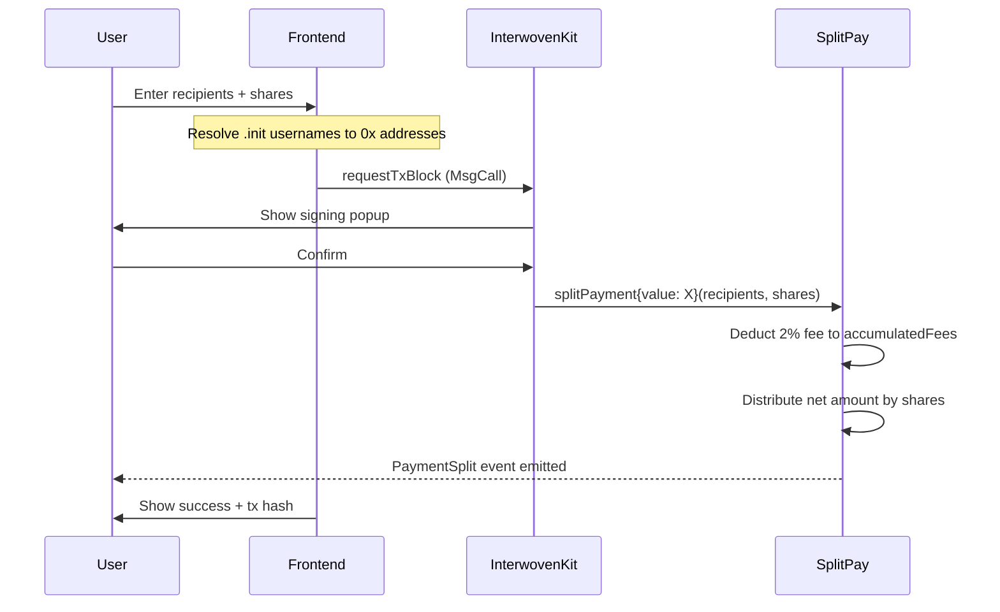

# SplitPay — Technical Specification

> Revenue-generating payment splitter on an Initia EVM Appchain.
> Split native token payments across multiple recipients with `.init` username resolution and a platform fee.

---

## 1. Project Overview

### What is SplitPay?

SplitPay is an EVM-based Initia Appchain that enables users to split native token payments across multiple recipients. The protocol charges a small platform fee on every split transaction, generating sustainable revenue for the appchain operator.

### The Problem

Splitting payments on-chain today requires manual multi-send operations or trust in off-chain tools. There is no protocol on Initia that combines:
- **One-click payment splitting** with gas-efficient on-chain execution
- **Human-readable addressing** via `.init` usernames
- **Built-in revenue generation** through protocol fees

### The Solution

A single `SplitPay.sol` smart contract that:
1. Accepts native token payments
2. Deducts a configurable platform fee (default 2%)
3. Distributes the remainder to N recipients by specified shares
4. Resolves `.init` usernames to `0x` addresses in the frontend before submission

---

## 2. Architecture Overview

```
splitpay/
├── .initia/
│   └── submission.json          # Hackathon submission metadata
├── splitpay-contract/           # Foundry project
│   ├── src/
│   │   └── SplitPay.sol         # Core payment splitter contract
│   ├── test/
│   │   └── SplitPay.t.sol       # Comprehensive test suite
│   ├── script/
│   │   └── Deploy.s.sol         # Deployment script
│   ├── foundry.toml             # Solidity 0.8.26, optimizer 200, Cancun
│   └── remappings.txt           # forge-std + OpenZeppelin v5
├── splitpay-frontend/           # Next.js 16 + InterwovenKit
│   ├── src/
│   │   ├── app/                 # App Router pages
│   │   ├── components/
│   │   │   └── providers/
│   │   │       └── interwoven-provider.tsx
│   │   ├── config/
│   │   │   ├── network.ts       # Rollup constants + customChain
│   │   │   └── contracts.ts     # ABI + deployed address
│   │   └── lib/
│   │       └── utils.ts         # cn() utility
│   ├── next.config.ts           # InterwovenKit transpile + Turbopack
│   ├── biome.json               # Biome 2.2 linting
│   └── package.json             # Dependencies
└── TECHNICAL_SPEC.md            # This document
```

### Tech Stack

| Layer | Technology |
|---|---|
| **Blockchain** | Initia EVM Rollup (`splitpay-rollup-1`) |
| **Smart Contracts** | Solidity 0.8.26, Foundry, OpenZeppelin v5 |
| **Frontend** | Next.js 16, React 19, TypeScript, Tailwind CSS v4 |
| **Wallet** | InterwovenKit (Privy wallet connector) |
| **EVM Integration** | wagmi v2, viem v2 |
| **Linting** | Biome 2.2 |
| **Animation** | Framer Motion |

---

## 3. Smart Contract Design — `SplitPay.sol`

### 3.1 Core Data Structures

```solidity
/// @notice Platform fee in basis points (100 = 1%)
uint256 public platformFeeBps;            // default: 200 (2%)
uint256 public constant BPS_DENOMINATOR = 10_000;
uint256 public constant MAX_RECIPIENTS = 20;

/// @notice Accumulated platform fees available for withdrawal
uint256 public accumulatedFees;

/// @notice A split payment record for event/history purposes
struct SplitRecord {
    address sender;
    address[] recipients;
    uint256[] shares;          // basis points per recipient, must sum to 10_000
    uint256 totalAmount;       // gross amount sent (before fee)
    uint256 feeAmount;         // platform fee deducted
    uint256 timestamp;
}
```

### 3.2 Core Functions

#### `splitPayment(address[] recipients, uint256[] shares)`
The primary user-facing function. Accepts `msg.value` in native tokens and distributes:

```
Gross Amount = msg.value
Platform Fee = Gross Amount * platformFeeBps / BPS_DENOMINATOR
Net Amount   = Gross Amount - Platform Fee

For each recipient[i]:
  payout[i] = Net Amount * shares[i] / BPS_DENOMINATOR
```

**Validations:**
- `msg.value > 0`
- `recipients.length == shares.length`
- `recipients.length > 0 && recipients.length <= MAX_RECIPIENTS`
- `sum(shares) == BPS_DENOMINATOR` (shares must total exactly 100%)
- No zero addresses in recipients
- No zero shares

**Gas optimization:** Single loop for validation + transfer. No storage writes for individual payments (only the fee accumulator and event emission).

#### `withdrawFees(address to)`
Owner-only. Withdraws all accumulated platform fees to a specified address.

#### `setFeeBps(uint256 newFeeBps)`
Owner-only. Update the platform fee. Capped at 1000 bps (10%) to prevent abuse.

#### `getAccumulatedFees() -> uint256`
View function returning current accumulated platform fees.

### 3.3 Events

```solidity
event PaymentSplit(
    address indexed sender,
    uint256 indexed splitId,
    uint256 totalAmount,
    uint256 feeAmount,
    uint256 recipientCount
);

event FeeWithdrawn(
    address indexed to,
    uint256 amount
);

event FeeBpsUpdated(
    uint256 oldFeeBps,
    uint256 newFeeBps
);
```

### 3.4 Security

| Concern | Mitigation |
|---|---|
| **Reentrancy** | `ReentrancyGuard` on all state-modifying functions |
| **Access Control** | `Ownable` for admin functions (fee withdrawal, fee update) |
| **Overflow** | Solidity 0.8.26 built-in overflow checks |
| **Fee caps** | `MAX_FEE_BPS = 1000` (10% hard cap) |
| **Recipient limits** | `MAX_RECIPIENTS = 20` to bound gas |
| **Failed transfers** | Use low-level `call` with success check, revert on failure |

### 3.5 Revenue Model

| Source | Model | Description |
|---|---|---|
| **Platform Fee** | 2% per split (configurable) | Deducted from every `splitPayment` before distribution |
| **Fee Withdrawal** | Owner withdraws accumulated fees | `withdrawFees()` sends accumulated balance to treasury |

**Example:** User splits 10 GAS tokens to 3 recipients:
- Platform fee: 0.2 GAS -> `accumulatedFees`
- Net distribution: 9.8 GAS -> split by shares to recipients

---

## 4. Frontend Architecture

### 4.1 Provider Setup (Implemented)

The InterwovenKit provider stack pattern:

```
QueryClientProvider
  └── WagmiProvider (wagmiConfig with splitPayEvmChain)
      └── InterwovenKitProvider
          ├── {...TESTNET} spread for bridge + public chain support
          ├── defaultChainId = "splitpay-rollup-1"
          ├── customChain = SPLITPAY_CUSTOM_CHAIN
          ├── customChains = [SPLITPAY_CUSTOM_CHAIN]
          └── theme = "dark"
```

**Key difference** We include `customChains` (plural array) in addition to `customChain` (singular) per InterwovenKit best practices. This ensures proper chain resolution in the bridge and wallet modals.

### 4.2 Planned Pages

| Route | Purpose |
|---|---|
| `/` | Landing/hero page — explains SplitPay, CTA to connect wallet |
| `/split` | Main split form — add recipients by address or `.init` username, set shares, pay |
| `/history` | Transaction history — past split payments from the connected wallet |

### 4.3 Transaction Flow



### 4.4 EVM Transaction Integration

All contract calls go through InterwovenKit's `requestTxBlock` with `MsgCall`:

```typescript
const msg = {
  typeUrl: "/minievm.evm.v1.MsgCall",
  value: {
    sender: initiaAddress.toLowerCase(),  // bech32, lowercased
    contractAddr: SPLITPAY_CONTRACT.address,
    input: encodeFunctionData({
      abi: SPLITPAY_CONTRACT.abi,
      functionName: "splitPayment",
      args: [recipientAddresses, shares],
    }),
    value: parseEther(amount).toString(),
    accessList: [],
    authList: [],
  },
}

await requestTxBlock({
  chainId: SPLITPAY_ROLLUP.chainId,
  messages: [msg],
})
```

---

## 5. `.init` Username Resolution

### 5.1 Strategy

Username resolution happens **entirely in the frontend** before submitting the transaction. The smart contract only receives raw `0x` EVM addresses.

### 5.2 Resolution Approaches (Priority Order)

1. **InterwovenKit Hook** (`useUsernameQuery`):
   - For displaying usernames of known addresses
   - Resolves `address -> username` (reverse lookup)

2. **Initia REST API** (for `username -> address` forward lookup):
   - Endpoint: `https://rest.testnet.initia.xyz/initia/usernames/v1/address/{username}`
   - Used when user types `@alice.init` in the recipient field
   - Frontend strips `.init`, calls the REST endpoint, receives bech32 address
   - Convert bech32 -> hex using `AccAddress.toHex()` from `@initia/initia.js`

3. **Fallback**: If resolution fails, show error and ask user to enter a raw `0x` address

### 5.3 UX Flow

```
User types: "@alice.init"
     |
Frontend calls: GET /initia/usernames/v1/address/alice
     |
Response: { "address": "init1abc...xyz" }
     |
Convert: AccAddress.toHex("init1abc...xyz") -> "0xABC...XYZ"
     |
Pass to contract: splitPayment(["0xABC...XYZ", ...], [...])
```

### 5.4 Input Flexibility

The recipient input field will support three formats:
- **`.init` username**: `@alice.init` -> resolves to `0x` via REST
- **Bech32 address**: `init1abc...` -> converts to `0x` via `AccAddress.toHex()`
- **Hex address**: `0xABC...` -> used directly

---

## 6. Deployment Plan

### 6.1 Appchain Setup

```bash
# Terminal 1: Start the rollup
weave rollup start

# Terminal 2: Start the executor
weave opinit start executor

# Terminal 3: Start the relayer
weave relayer start
```

### 6.2 Contract Deployment

```bash
cd splitpay-contract

# Deploy using Foundry script
forge script script/Deploy.s.sol:Deploy \
  --rpc-url http://localhost:8545 \
  --broadcast

# OR deploy via minitiad CLI
jq -r '.bytecode.object' out/SplitPay.sol/SplitPay.json | tr -d '0x' > splitpay.bin
minitiad tx evm create splitpay.bin \
  --from gas-station \
  --keyring-backend test \
  --gas auto --gas-adjustment 1.5 \
  --chain-id splitpay-rollup-1
rm splitpay.bin  # cleanup per workspace hygiene rules
```

### 6.3 Frontend Wiring

After deployment:
1. Copy the deployed contract address into `src/config/contracts.ts`
2. Copy the ABI from `out/SplitPay.sol/SplitPay.json` into the contracts config
3. Start the dev server: `pnpm dev`

---

## 7. Verification Plan

### Automated Tests (Contract)

```bash
cd splitpay-contract
forge test -v                    # Run all tests
forge test --gas-report          # Gas usage analysis
forge snapshot                   # Gas snapshot
```

**Test coverage targets:**
- Basic split with 2 recipients (50/50)
- Unequal splits (e.g., 70/30)
- Maximum recipients (20)
- Platform fee deduction accuracy
- Fee withdrawal by owner
- Fee update with cap enforcement
- Reverts: zero value, mismatched arrays, shares != 100%, zero address, too many recipients
- Reentrancy protection

### Frontend Verification

```bash
cd splitpay-frontend
pnpm build                       # TypeScript compilation check
pnpm lint                        # Biome linting
```

### Manual Verification

- Connect wallet via InterwovenKit
- Split payment to 3 test addresses
- Verify balances change correctly
- Verify platform fee accumulates
- Test `.init` username resolution

---

## 8. Current Status

| Component | Status | Details |
|---|---|---|
| `splitpay-contract/` | ✅ Initialized | Foundry project with Solidity 0.8.26, OpenZeppelin v5, placeholder SplitPay.sol compiles and passes basic test |
| `splitpay-frontend/` | ✅ Initialized | Next.js 16, InterwovenKit provider configured, all dependencies installed |
| `TECHNICAL_SPEC.md` | ✅ Complete | This document — ready for review |
| `.initia/submission.json` | ✅ Template created | Placeholders for repo URL, deployed address, demo video |
| Core contract logic | ⏳ Pending | Awaiting spec approval |
| Frontend UI | ⏳ Pending | Awaiting spec approval |
| Username resolution | ⏳ Pending | Awaiting spec approval |
| Appchain deployment | ⏳ Pending | Requires running Initia rollup |

---

## 9. Next Steps (After Approval)

1. **Implement `SplitPay.sol`** — full contract logic with all functions, events, and security
2. **Write comprehensive tests** — `SplitPay.t.sol` with all edge cases
3. **Build the frontend UI** — landing page, split form, history page
4. **Implement username resolution** — `.init` to `0x` conversion service
5. **Deploy to rollup** — contract deployment and frontend wiring
6. **Record demo video** — end-to-end split payment with username resolution
